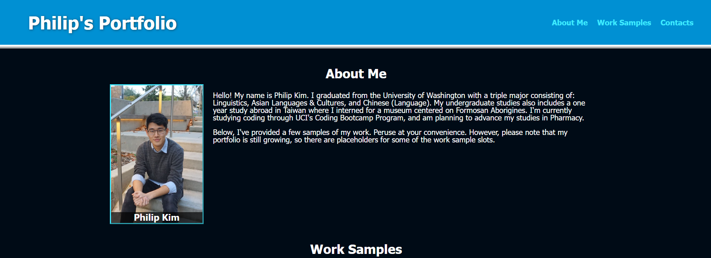
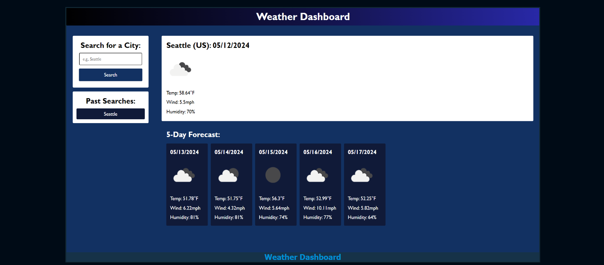
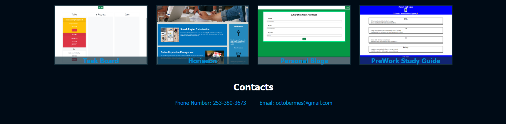

# portfolio

## Description

This webpage is designed to showcase my skills and talents as a developer. My portfolio as well as my skills in this field are still growing. However, in this webpage portfolio, I've included a few samples of work that I've completed or that I'm working on. The creation of this webpage porfolio was a fun task that gave me an opportunity to develop a holistic understanding of the web development process at a level of complexity I can manage at the current stage of my studies. However, this portfolio may change in content or even form in the future as my experience grows.

## Usage

To open the website portfolio, click this link here to go directly!

[Philip's Portfolio](https://geovko.github.io/portfolio/)

*OR* Copy this link to paste it into a browser.
  ```md
https://geovko.github.io/portfolio/
  ```

At the upper-right of the webpage, three options are listed, each referring to a section on the webpage. By clicking one of these options you will be pulled to the related section of the webpage. In the Work Samples section, multiple work samples are organized into several clickable boxes. Clicking on these boxes will take you to the deployed webpage, they are indicating. However, the two boxes at the very bottom will not take you to any other site as they are only placeholders meant for future projects.






## Credits

This project wouldn't have been completed without the aid of tutorials and assignments provided by the UCI Bootcamp teaching staff.

## License

MIT License
